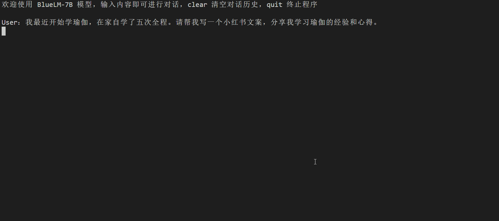
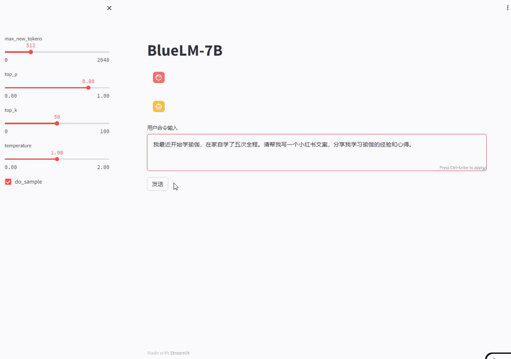

<div align="center">
<h1>
  BlueLM
</h1>
</div>

<p align="center">
🤗 <a href="https://huggingface.co/vivo-ai" target="_blank">Hugging Face</a> • 👾 <a href="https://www.modelscope.cn/organization/vivo-ai" target="_blank">ModelScope</a> • 🤖 <a href="https://www.wisemodel.cn/organization/vivo-ai" target="_blank">wisemodel</a> • 📜 <a href="https://github.com/vivo-ai-lab/BlueLM/blob/main/OpenAtom%20Model%20License.pdf" target="_blank">LICENSE</a> • 🎯 <a href="https://developers.vivo.com/product/ai/bluelm" target="_blank">vivo Developers</a> • 🗨 <a href="resources/wechat.png" target="_blank">WeChat</a>
</p>

<div align="center">

<h4 align="center">
    <p>
        <b>中文</b> |
        <a href="README_EN.md">English</a>
    <p>
</h4>

</div>

# 目录

- [📔 模型介绍](#模型介绍)
- [📊 评测结果](#评测结果)
- [🚀 推理部署](#推理部署)
- [⚒ 模型微调](#模型微调)
- [📚 声明、协议、引用](#声明协议引用)
- [📠 联系我们](#联系我们)

# 新闻

- 2024年3月25日更新 BlueLM-7B-Chat-32K 模型参数，支持 function calling 能力。我们在 [api_server.py](openai_api_demo/api_server.py) 中提供了 OpenAI 格式的 API。更新 BlueLM-7B-Chat-32K-AWQ 和 BlueLM-7B-Chat-32K-GPTQ 模型。
- 2024年12月25日将本项目的大模型开源许可证变更为 [开放原子模型许可证](https://github.com/vivo-ai-lab/BlueLM/blob/main/OpenAtom%20Model%20License.pdf)。
# 模型介绍

BlueLM 是由 vivo AI 全球研究院自主研发的大规模预训练语言模型，本次发布包含 7B 基础 (base) 模型和 7B 对话 (chat) 模型，同时我们开源了支持 **32K** 的长文本基础 (base) 模型和对话 (chat) 模型。

- **更大量的优质数据**：高质量语料库进行训练，规模达到了 **2.6 万亿** 的 token 数，该语料库包含中文、英文以及少量日韩数据；
- **更优的效果**：其中 BlueLM-7B-Chat 在 **C-Eval** 和 **CMMLU** 上均取得领先结果，对比同尺寸开源模型中具有较强的竞争力；
- **长文本支持**：BlueLM-7B-Base-32K 和 BlueLM-7B-Chat-32K 均支持 **32K** 长文本，在保持基础能力相当情况下，能够支持更长上下文理解；
- **协议说明**：BlueLM 系列欢迎开发者进行学术研究和商业应用；

本次发布基座模型下载链接见：

|        | 基座模型                                                                       | 对齐模型                                                                       | 量化模型                                                                                                                                                                   |
|:-------|:---------------------------------------------------------------------------|:---------------------------------------------------------------------------|:-----------------------------------------------------------------------------------------------------------------------------------------------------------------------|
| 7B-2K  | 🤗 [BlueLM-7B-Base](https://huggingface.co/vivo-ai/BlueLM-7B-Base)         | 🤗 [BlueLM-7B-Chat](https://huggingface.co/vivo-ai/BlueLM-7B-Chat)         | 🤗 [BlueLM-7B-Chat-4bits](https://huggingface.co/vivo-ai/BlueLM-7B-Chat-4bits)                                                                                         |
| 7B-32K | 🤗 [BlueLM-7B-Base-32K](https://huggingface.co/vivo-ai/BlueLM-7B-Base-32K) | 🤗 [BlueLM-7B-Chat-32K](https://huggingface.co/vivo-ai/BlueLM-7B-Chat-32K) | 🤗 [BlueLM-7B-Chat-32K-AWQ](https://huggingface.co/vivo-ai/BlueLM-7B-Chat-32K-AWQ) / [BlueLM-7B-Chat-32K-GPTQ](https://huggingface.co/vivo-ai/BlueLM-7B-Chat-32K-GPTQ) |

欢迎阅读我们的技术报告[BlueLM: An Open Multilingual 7B Language Model](https://github.com/vivo-ai-lab/BlueLM/blob/main/BlueLM_technical_report.pdf)！

我们后续将开源 13B 模型和支持多模态的 7B-vl 模型，还请期待！

# 评测结果

为了保证模型评测的一致性，我们采用 [OpenCompass](https://opencompass.org.cn/leaderboard-llm) 进行相关榜单的评测。我们分别在 C-Eval、MMLU、CMMLU、GaoKao、AGIEval、BBH、GSM8K、MATH 和 HumanEval 榜单对 BlueLM 的通用能力、数学能力和代码能力进行了测试。

## 测评榜单

- [C-Eval](https://cevalbenchmark.com/index.html) 是一个全面的中文基础模型评测数据集，它包含了 13948 个多项选择题，涵盖了 52 个学科和四个难度级别。我们使用了 few shot 的方法来进行测试。
- [MMLU](https://arxiv.org/abs/2009.03300) 是一个包含了 57 个子任务的英文评测数据集，涵盖了初等数学、美国历史、计算机科学、法律等，难度覆盖高中水平到专家水平，有效地衡量了人文、社科和理工等多个大类的综合知识能力。我们使用了 few shot 的方法来进行测试。
- [CMMLU](https://github.com/haonan-li/CMMLU) 是一个包含了 67 个主题的中文评测数据集，涉及自然科学、社会科学、工程、人文、以及常识等，有效地评估了大模型在中文知识储备和语言理解上的能力。我们使用了 few shot 的方法来进行测试。
- [Gaokao](https://github.com/OpenLMLab/GAOKAO-Bench) 是一个中国高考题目的数据集，旨在直观且高效地测评大模型语言理解能力、逻辑推理能力的测评框架。我们只保留了其中的单项选择题，使用 zero shot 的方法来进行测试。
- [AGIEval](https://github.com/ruixiangcui/AGIEval) 是一个用于评估基础模型在标准化考试（如高考、公务员考试、法学院入学考试、数学竞赛和律师资格考试）中表现的数据集。我们只保留了其中的四选一单项选择题，使用 zero shot 的方法来进行测试。
- [BBH](https://huggingface.co/datasets/lukaemon/bbh) 是一个挑战性任务 Big-Bench 的子集。Big-Bench 涵盖了语言学、儿童发展、数学、常识推理、生物学、物理学、社会偏见、软件开发等方面。BBH 更专注于其中 23 个具有挑战性的任务。我们使用了 few shot 的方法来进行测试。
- [GSM8K](https://github.com/openai/grade-school-math) 是一个高质量的英文小学数学问题测试集，包含 7.5K 训练数据和 1K 测试数据。这些问题通常需要 2-8 步才能解决，有效评估了数学与逻辑能力。我们使用了 few shot 的方法来进行测试。
- [MATH](https://huggingface.co/datasets/competition_math) 是一个由数学竞赛问题组成的评测集，由 AMC 10、AMC 12 和 AIME 等组成，包含 7.5K 训练数据和 5K 测试数据。我们使用 few shot 的方法来进行测试。
- [HumanEval](https://huggingface.co/datasets/openai_humaneval) 是由 OpenAI 发布的 164 个手写的编程问题，包括模型语言理解、推理、算法和简单数学等任务。我们使用 zero shot 的方法来进行测试。
- [LongBench](https://github.com/THUDM/LongBench) 是第一个用于对大型语言模型进行双语、多任务、全面评估长文本理解能力的基准测试。
- [T-Eval](https://github.com/open-compass/T-Eval) 是第一个用于对大型语言模型的工具使用能力进行全面评估的测试集，涵盖有工具调用\(Function call\)、规划、执行信息抽取、工具运行日志评估等多维度。我们使用 zero shot 的方法在它的中文测试集上进行测试。

## 7B 模型结果

| Model             | **C-Eval** | **MMLU** | **CMMLU**  | **Gaokao**   | **AGIEval**   | **BBH**      | **GSM8K**   | **MATH**   | **HumanEval**   |
|:------------------|:-----------|:---------|:-----------|:-------------|:--------------|:-------------|:------------|:-----------|:----------------|
|                   | 5-shot     | 5-shot   | 5-shot     | 0-shot       | 0-shot        | 3-shot       | 4-shot      | 5-shot     | 0-shot          |
| GPT-4             | 69.9       | **86.4** | 71.2       | **72.3**     | **55.1**      | **86.7**     | **91.4**    | **45.8**   | **74.4**        |
| ChatGPT           | 52.5       | 70.0     | 53.9       | 51.1         | 39.9          | 70.1         | 78.2        | 28         | 73.2            |
| LLaMA2-7B         | 32.5       | 45.3     | 31.8       | 18.9         | 21.8          | 38.2         | 16.7        | 3.3        | 12.8            |
| ChatGLM2-6B(Base) | 51.7       | 47.9     | 50.0       | -            | -             | 33.7         | 32.4        | 6.5        | -               |
| Baichuan2-7B      | 56.3       | 54.7     | 57.0       | 34.8         | 34.6          | 41.8         | 24.6        | 5.4        | 17.7            |
| BlueLM-7B-Base    | 67.5       | **55.2** | 66.6       | **58.9**     | **43.4**      | 41.7         | 27.2        | 6.2        | 18.3            |
| BlueLM-7B-Chat    | **72.7**   | 50.7     | **74.2**   | 48.7         | **43.4**      | **65.6**     | **51.9**    | **13.4**   | **21.3**        |

## 7B-32K 模型结果

我们还在 LongBench 和 T-Eval 评测集上对我们的 BlueLM-7B-Chat-32K 模型进行了测试，具体结果如下表所示：

### LongBench

| Model                 | 平均   | Summary  | Single-Doc QA | Multi-Doc QA  | Code  | Few-shot | Synthetic |
|:----------------------|:-----|:---------|:--------------|:--------------|:------|:---------|:----------|
| BlueLM-7B-Chat-32K    | 41.2 | 18.8     | 35.6          | 36.2          | 54.2  | 56.9     | 45.5      |

### T-Eval-ZH

| Model                 | instruct | plan     | reason   | retrieve | understand | review   | overall  |
|:----------------------|:---------|:---------|:---------|:---------|:-----------|:---------|:---------|
| Qwen-7B               | 82.3     | 62.2     | 50.0     | 59.1     | 67.0       | 57.1     | 63.0     |
| Qwen-14B              | **96.5** | **77.1** | 57.0     | 73.0     | **76.5**   | 43.7     | 70.6     |
| BlueLM-7B-Chat-32K    | 79.6     | 63.4     | **61.5** | **73.9** | 74.2       | **73.9** | **71.3** |

# 推理部署

## 环境依赖

首先需要下载本仓库：

```
git clone https://github.com/vivo-ai-lab/BlueLM
cd BlueLM
```

然后使用 pip 安装依赖：

```
pip install -r requirements.txt
```

使用 BlueLM-7B-Base-32K 或 BlueLM-7B-Chat-32K，请额外安装 flash_attn：

```
pip install flash_attn==2.3.3
```

如果安装失败，建议安装[预编译版本](https://github.com/Dao-AILab/flash-attention/releases/)的 flash_attn。

## 代码调用

### Base 模型推理示例

```python
>>> from transformers import AutoModelForCausalLM, AutoTokenizer
>>> tokenizer = AutoTokenizer.from_pretrained("vivo-ai/BlueLM-7B-Base", trust_remote_code=True, use_fast=False)
>>> model = AutoModelForCausalLM.from_pretrained("vivo-ai/BlueLM-7B-Base", device_map="cuda:0", trust_remote_code=True)
>>> model = model.eval()
>>> inputs = tokenizer("儒林外史->吴敬梓\n隋唐演义->褚人获\n红楼梦->", return_tensors="pt")
>>> inputs = inputs.to("cuda:0")
>>> pred = model.generate(**inputs, max_new_tokens=64, repetition_penalty=1.1)
>>> print(tokenizer.decode(pred.cpu()[0], skip_special_tokens=True))
儒林外史->吴敬梓
隋唐演义->褚人获
红楼梦->曹雪芹
三国演义->罗贯中
水浒传->施耐庵
西游记->吴承恩
聊斋志异->蒲松龄
封神演义->许仲琳
东周列国志->冯梦龙
三侠五义->石玉昆
七剑十三侠->唐芸洲
```

## 命令行 Demo



```shell
python cli_demo.py
```

本命令行 Demo 仅支持 Chat 场景。

## 网页 Demo



```shell
streamlit run web_demo.py --server.port 8080
```

本网页 Demo 仅支持 Chat 场景。

## OpenAI API Demo

运行 [api_server.py](openai_api_demo/api_server.py) 部署 OpenAI 格式的代码，支持基于 ChatGPT 应用后端。

```shell
cd openai_api_demo
python api_server.py
```

python 测试代码，包括支持流式响应和 function calling 的请求。

```shell
cd openai_api_demo
python openai_api_request.py
```

## Tool Demo

可在命令行运行工具使用 Demo [cli_demo_tool.py](cli_demo_tool.py), demo 中已提供可作为测试的工具 sample。

```shell
python cli_demo_tool.py
```

根据命令行提示分别输入问题与外部工具的执行结果，完成一次工具调用需进行两轮对话。

示例："<>"内为待用户输入内容。

```
用户: <杭州今天的湿度是多少？>
BlueLM:
{\"answer\": null, \"function_calls\": [{\"name\": \"current-weather\", \"parameters\": {\"city\": \"杭州\"}}]}
工具结果: <{\"city\": \"杭州\", \"weather\": \"当前天气 晴，气温20摄氏度，风力2级，湿度40%\"}>
BlueLM:
{"answer": "杭州湿度40%。", "function_calls": null}
```

## BlueLM-7B-Chat 示例输出

<details><summary><b>代码</b></summary>

`````
User：某在线教育平台的课程数据存储在一个名为courses的列表中，每门课程用字典表示，包含课程名称（name）、教师姓名（teacher）和学生人数（students）三个字段。请编写一个Python函数，根据学生人数，计算课程的平均学生人数，并返回。

BlueLM-7B：下面是实现代码：

```python
def average_students(courses):
    total_students = 0
    count = 0
    for course in courses:
        total_students += course['students']
        count += 1
    if count == 0:
        return 0
    else:
        return total_students / count
```

这个函数接受一个课程列表作为参数，然后遍历列表中的每个课程，累加学生人数的总和，同时记录课程的数量。最后，如果列表为空，则返回0；否则，返回学生人数的平均值。
`````

</details>

<details><summary><b>数学</b></summary>

`````
User：朵朵有100元，她要买两本绘画书，绘画书每本40元，朵朵买完绘画书还剩多少元？

BlueLM-7B：可以先计算两本绘画书需要支付的总金额，然后计算购买后还剩下的金额。

已知朵朵有的钱数为：100元；

已知每本绘画书的价格为：40元；

因此，两本绘画书需要支付的总金额为：$40 \times 2 = 80$元；

购买两本绘画书后，还剩下的金额为：$100 - 80 = 20$元；

所以，朵朵买完绘画书还剩下20元。
`````

</details>

<details><summary><b>角色扮演</b></summary>

`````
User：我是一名营销经理，最近我们推出了一款新产品，但是销售情况并不理想。这款产品是一款健康食品，主打低脂低糖，适合健身人群和需要控制饮食的人群。我们已经尝试过线上营销、线下推广、与知名健身房合作等方式，但是效果都不明显。你能帮我分析一下可能的原因以及提供一些销售策略吗？

BlueLM-7B：分析：

1. 竞争激烈：市场上已经存在许多类似的产品，消费者有更多的选择，导致新产品的市场占有率为零或很低。

2. 价格过高：该产品的价格比同类其他产品更高，可能会使消费者更倾向于购买其他品牌或更便宜的选项。

3. 缺乏宣传：没有足够的宣传使得消费者对该产品的了解程度不够，从而无法吸引更多的消费者。

4. 销售渠道不当：虽然已经尝试了多种销售方式，但可能没有选择到最适合的渠道，导致销售情况不佳。

策略：

1. 降低价格：考虑降低价格以吸引更多的消费者，同时保持产品质量和品质。

2. 加强宣传：增加宣传力度，包括在社交媒体上发布广告、增加线上营销等方式，提高消费者对产品的认知度。

3. 寻找合适的销售渠道：考虑与健身房等机构进行合作，或者寻找更符合目标消费者的销售渠道。

4. 改进产品：根据消费者的反馈意见，对产品进行改进，提高其质量和受欢迎程度。
`````
</details>

## 量化部署

我们提供了 BlueLM-7B-Chat 的 4bits 版本 [BlueLM-7B-Chat-4bits](https://huggingface.co/vivo-ai/BlueLM-7B-Chat-4bits)。如果你的 GPU 显存有限，可以尝试加载 4-bits 模型，只需要 5GB 显存。且经过测试，BlueLM 在 4-bits 量化下仍能流畅地生成文本。

安装依赖：

```
cd BlueLM/quant_cuda
python setup_cuda.py install
```

加载模型推理示例：

```python
>>> from transformers import AutoTokenizer, AutoModelForCausalLM
>>> tokenizer = AutoTokenizer.from_pretrained("vivo-ai/BlueLM-7B-Chat-4bits", trust_remote_code=True, use_fast=False)
>>> model = AutoModelForCausalLM.from_pretrained("vivo-ai/BlueLM-7B-Chat-4bits", device_map="cuda:0", trust_remote_code=True)
>>> model = model.eval()
>>> inputs = tokenizer("[|Human|]:三国演义的作者是谁？[|AI|]:", return_tensors="pt")
>>> inputs = inputs.to("cuda:0")
>>> outputs = model.generate(**inputs, max_new_tokens=128)
>>> print(tokenizer.decode(outputs.cpu()[0], skip_special_tokens=True))
三国演义的作者是谁？ 《三国演义》是由元末明初小说家罗贯中所著，是中国古典四大名著之一，也是中国古代历史小说发展的巅峰之作。
```

## 推理加速

### vLLM 环境准备

我们基于 [vllm](https://github.com/vllm-project/vllm) 推理框架，添加了 BlueLM 模型推理代码，代码在 `example/vllm` 目录中。 

环境准备及编译：

运行环境需要英伟达驱动版本为 525.125.06，同时 cuda 版本为 12.1。

```
python -m venv vllm
source vllm/bin/activate

cd example/vllm
pip install -e .
``` 

### vLLM 模型推理示例

```
python vllm_demo.py
```

# 模型微调

## 环境依赖

```
pip install deepspeed==0.10.3
```

## 数据准备

为了简单展示模型的微调流程，我们在 [BELLE 项目 50w 中文指令](https://huggingface.co/datasets/BelleGroup/train_0.5M_CN) 中随机抽取了 1w 条中文指令数据，处理后的数据路径为 `data/bella_train_demo.json` 和 `data/bella_dev_demo.json`。

## 全量微调训练

获得处理完的数据后，可通过训练脚本 `script/bluelm-7b-sft.sh` 配置相应的路径和超参数，进行全量微调训练。

相关参数的说明如下所示：

| Parameter                       | Description                                 |
|:--------------------------------|:--------------------------------------------|
| **num_gpus**                    | 对应 GPU 的卡数                                  |
| **train_file**                  | 训练数据的路径                                     |
| **prompt_column**               | 数据集指令问题的列名                                  |
| **response_column**             | 数据集指令回复的列名                                  |
| **model_name_or_path**          | 预加载模型的存储路径                                  |
| **output_dir**                  | 微调模型的保存路径                                   |
| **tensorboard_dir**             | tensorboard的保存路径                            |
| **seq_len**                     | 训练序列的最大长度                                   |
| **batch_size_per_device**       | 训练迭代中每个 GPU 输入的样本数量                         |
| **gradient_accumulation_steps** | 梯度累积的步长，默认为 1，表示不进行梯度累积                     |
| **gradient_checkpointing**      | 是否开启激活重算                                    |
| **max_steps**                   | 模型训练的迭代数                                    |
| **save_steps**                  | 模型训练的保存周期                                   |
| **learning_rate**               | 初始学习率                                       |
| **finetune**                    | 是否开启模型微调                                    |

使用全量微调的启动命令如下：

```sh
cd train
sh script/bluelm-7b-sft.sh
```

## LoRA 微调训练

本项目支持 LoRA 的微调训练。关于 LoRA 的详细介绍可以参考论文 [LoRA: Low-Rank Adaptation of Large Language Models](https://arxiv.org/abs/2106.09685) 以及 Github 仓库 [LoRA](https://github.com/microsoft/LoRA)。

主要参数说明如下：

| Parameter                       | Description                                    |
|:--------------------------------|:-----------------------------------------------|
| **lora_rank**                   | lora 矩阵的秩。一般设置为 8、16、32、64 等。                  |
| **lora_alpha**                  | lora 中的缩放参数。一般设为 16、32 即可                      |
| **lora_dropout**                | lora 权重的 dropout rate。                         |

使用 LoRA 微调的启动命令如下：

```sh
cd train
sh script/bluelm-7b-sft-lora.sh
```

# 声明、协议、引用

## 声明

我们在此郑重声明，对于所有使用开源模型的有关方，强烈呼吁不要进行任何损害国家社会安全或违反相关法律的行为，也恳请使用者不把 BlueLM 模型用于未经适当安全审批和备案的产品应用中。请务必在合法、合规的前提下开展一切业务活动，我们期望所有使用者都能以此为准。

同时，本模型“按原样”提供，我们也已尽全力确保数据的合规性，但由于模型训练和数据的复杂性，仍可能存在一些无法预估的问题，我们也强烈建议使用者对模型应用风险做详尽评估，确保应用的合法合规，如使用 BlueLM 开源模型而导致的任何问题，我们将不承担任何责任。

## 协议

为了使本项目更加开放、灵活，服务更多开发者与用户，自2024年12月25日起，本项目的大模型开源许可证进行了一次重要更新，由 [原vivo_BlueLM模型许可协议](MODEL_LICENSE.pdf) 变更为 [开放原子模型许可证](https://github.com/vivo-ai-lab/BlueLM/blob/main/OpenAtom%20Model%20License.pdf)。

基于全新的大模型开源许可证，使用者可以在更少的限制下使用、修改和分发本项目的大模型。请确保您阅读并理解新的 [许可证内容](https://github.com/vivo-ai-lab/BlueLM/blob/main/OpenAtom%20Model%20License.pdf)。

## 引用

```
@misc{2023bluelm,
    title={BlueLM: An Open Multilingual 7B Language Model},
    author={BlueLM Team},
    howpublished = {\url{https://github.com/vivo-ai-lab/BlueLM}},
    year={2023}
}
```

# 联系我们

如有任何疑问，可以通过邮件（developers-ai@vivo.com）联系我们，也可以加入 BlueLM 微信交流群探讨。


